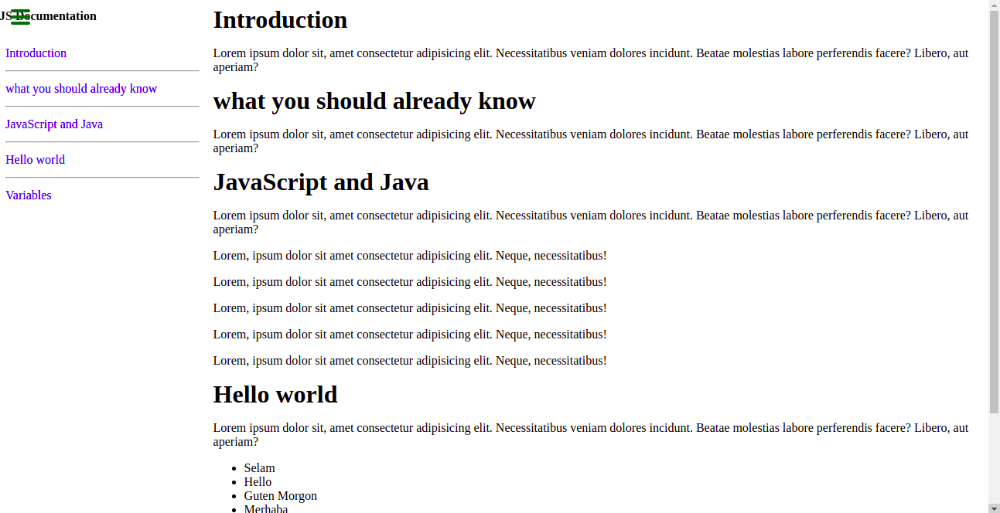

# JS Documentation

> In this project a technical documentation landing page template is developed using HTML and CSS.

## Desktop Version
 

## Built With

- HTML
- CSS

## Live Demo
  Coming soon!

## Getting Started

 To get a local copy up and running follow these simple example steps.

### Prerequisites
- Install text editor of your choice (eg. VS Code)
- Clone the repository from [here](https://github.com/gtekle/JS-Documentation.git)
- Open the index.html file in your browser to check your updates and navigate to other pages.

## Author

👤 **Tekle Gebreyohannes**

- GitHub: [@gtekle](https://github.com/gtekle)
- LinkedIn: [LinkedIn](https://linkedin.com/in/gtekle)

## 🤝 Contributing

Contributions, issues, and feature requests are welcome!

Feel free to check the [issues page](../../issues/).

## Show your support

Give a ⭐️ if you like this project!

## Acknowledgments

- [freecodecamp.org](https://www.freecodecamp.org/)

## 📝 License

This project is [MIT](./MIT.md) licensed.
